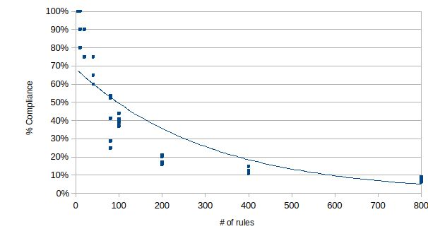

# Rule-Fatigue LLM Experiment

A simple Python script to measure and visualize how well an LLM (GPT-4.1) follows rules.\
THe experiment asks the model to write a short story with an increasing number of "include this word" rules and measures how often it follows the rules.


---

## 📋 Features

* **Rule Sampling:** Randomly selects sets of words (rules) from a system dictionary.
* **LLM Invocation:** Sends prompts to OpenAI’s GPT-4.1 with retry/backoff on transient errors.
* **Adherence Measurement:** Calculates how many rules were honored in each generated story.
* **Data Recording:** Writes raw results to a CSV (`gpt41results.csv`).
* **Snapshots:** Saves the prompt and story of the first trial for each rule count in `outputs/`.
* **Analysis & Plotting:** Computes mean ± std adherence by rule count and displays an error‐bar plot.

---

## ⚙️ Prerequisites

* **Python:** 3.8 or newer
* **Dependencies:**

  * `openai`
  * `pandas`
  * `matplotlib`

You can install all requirements with:

```bash
pip install openai pandas matplotlib
```

---

## 🔧 Configuration

1. Copy the example config (if provided) or create a file named `config.py` in the project root:

   ```python
   # config.py
   OPENAI_API_KEY = "your-openai-api-key"
   ```

2. Ensure your API key has permission to call the model `gpt-4.1`.

---

## 🚀 Usage

1. **Run the experiment:**

   ```bash
   python fatigue_test.py
   ```

2. **Review outputs:**

   * **CSV:** `gpt41results.csv` will contain columns: `R` (rule count), `trial`, `passed`, `failed`, `adherence`.
   * **Snapshots:** The `outputs/` folder will hold the first prompt/story files for each `R`.

3. **Analyze results:** After the experiment finishes, an error‐bar plot of adherence vs. rule count will appear automatically.

---

## 📂 File Structure

```
project_root/
├── fatigue_test.py   # Main script
├── config.py                     # Contains OPENAI_API_KEY
├── gpt41results.csv              # Generated data
└── outputs/                      # Saved prompt/story snapshots
```

---

## 📝 Logging

* Logs are printed to stdout at INFO level by default.
* Transient network or rate‐limit errors trigger retries with exponential backoff.

---

## 📜 License

Distributed under the MIT License. See `LICENSE` for details.
